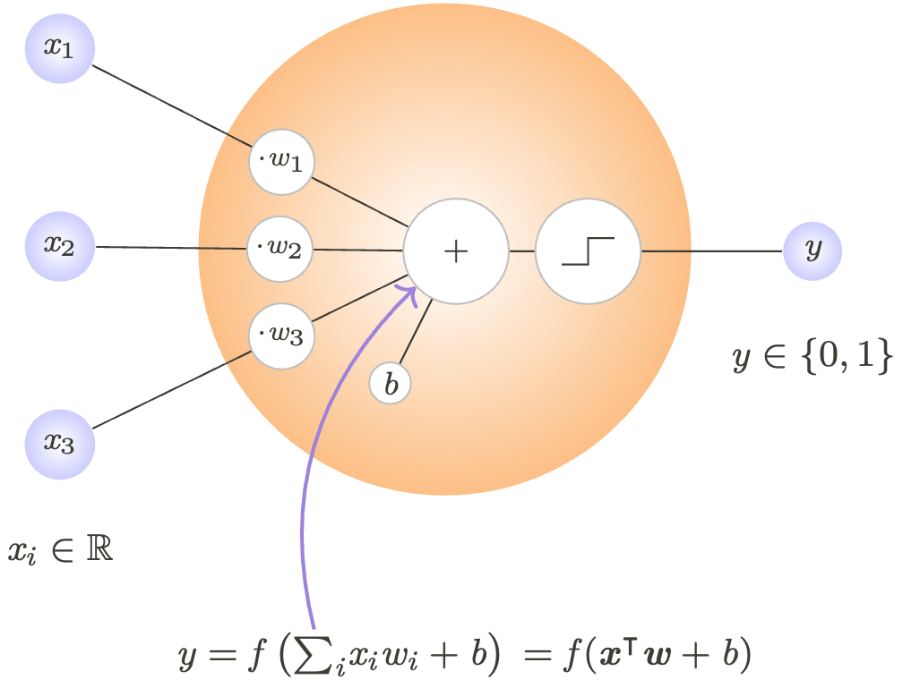
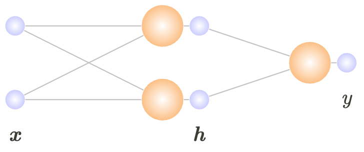
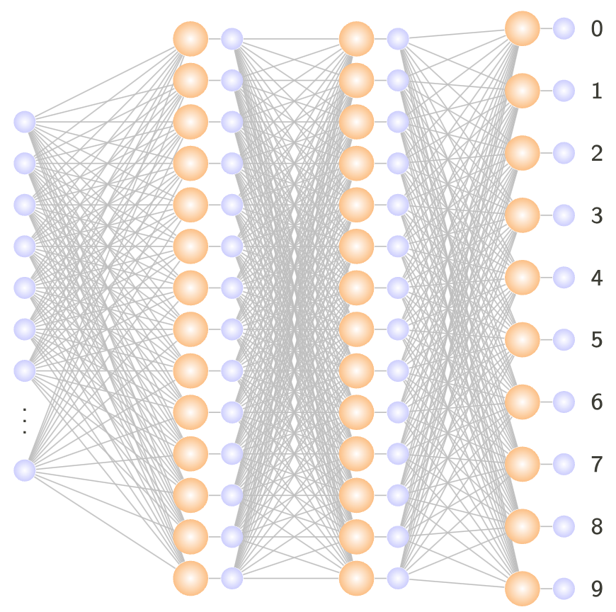

# Exercise 1: Introduction to Deep Learning
<div>
    <table>
        <tr style="background-color:white">
            <td></td>
            <td></td>
            <td></td>
        </tr>
    </table>
</div>

## Overview

In this exercise we will explore the basic building block of deep learning: the perceptron, and how to stack multiple perceptrons together into layers to build a neural network. We will also introduce convolutional neural networks (CNNs) for image classification.

In particular, we will:
- Implement a perceptron and a 2-layer perceptron to compute the XOR function using NumPy.
- Introduce PyTorch, a popular framework for deep learning.
- Implement and train a simple neural network (a multi-layer perceptron) to classify points in a 2D plane using PyTorch.
- Implement and train a simple deep convolutional neural network to classify hand-written digits from the MNIST dataset using PyTorch.
- Discuss important topics in ML/DL, such as data splitting, under/overfitting and model generalization.

## Setup

Please run the setup script to create the environment for this exercise.

```bash
source setup.sh
```

When you are ready to start the exercise run `jupyter lab`.
```bash
jupyter lab
```

...and continue with the instructions in the notebook.
